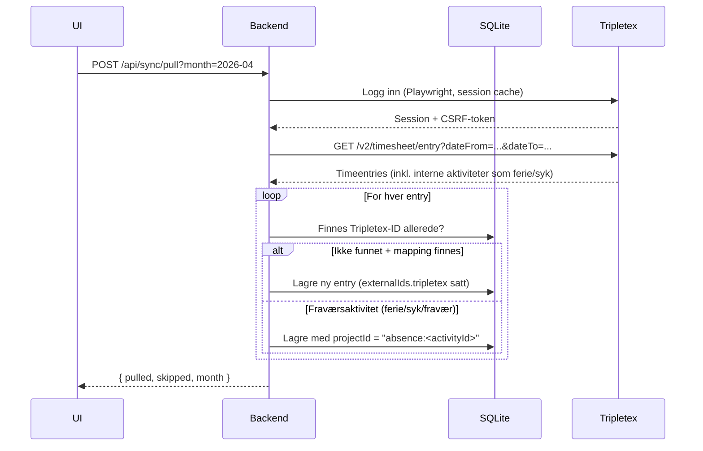
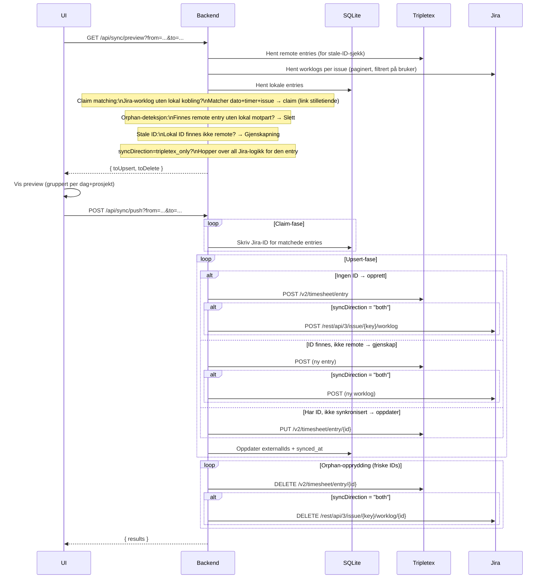

# timesynk

> ⚠️ **Dette prosjektet er 100% vibe-coded med GitHub Copilot.** Ingen av linjene er skrevet for hånd. Koden fungerer, men er ikke nødvendigvis pen.

Et lokalt timeregistreringsverktøy som fungerer som **master-kilde** og synkroniserer timer mot **Tripletex** og **Jira**. Du fører timer i appen, og appen holder Tripletex og Jira i sync.

---

## Hvorfor kreves brukernavn og passord?

Tripletex tilbyr et API, men å få tilgang krever en søknadsprosess for å få utstedt en developer API-nøkkel. timesynk omgår dette ved å logge inn i Tripletex **med ditt vanlige brukernavn og passord** via en headless nettleser (Playwright/Chromium), akkurat som om du hadde åpnet nettleseren selv. Session-cookien caches i SQLite så du slipper å logge inn på nytt hele tiden.

**Jira** bruker et API-token (ikke passord). Du genererer dette under [Atlassian-kontoen din](https://id.atlassian.com/manage-profile/security/api-tokens).

Alt kjører **lokalt på din maskin** — ingenting sendes til tredjeparter utover Tripletex og Jira sine egne API-er.

---

## Oppsett

1. Kopier `secrets.example.json` til `secrets.json` og fyll inn:

```json
{
  "tripletex": {
    "username": "din@epost.no",
    "password": "dittpassord"
  },
  "jira": {
    "baseUrl": "https://yourcompany.atlassian.net",
    "email": "din@epost.no",
    "apiToken": "your-jira-api-token"
  }
}
```

2. Installer og start:

```bash
npm install
npm run dev
```

Åpne [http://localhost:5173](http://localhost:5173). Backend kjører på port 3001.

3. **Sett opp prosjekter** under *Innstillinger*:
   - Opprett ett prosjekt per aktivitet du fører tid på
   - Koble hvert prosjekt til Tripletex-prosjekt + aktivitet og (valgfritt) Jira-issue
   - For ferie, syk og annet fravær: velg type **Fravær / intern aktivitet** og sett synkretning til **Kun Tripletex**

4. Klikk **Hent fra Tripletex** for å importere eksisterende timer inn i appen.

---
## Fravær og interne aktiviteter

Tripletex har interne aktiviteter (Ferie, Syk 1–3 dager, Fravær u/lønn osv.) som ikke er knyttet til prosjekter. Disse konfigureres med `syncDirection = "tripletex_only"` slik at de aldri pushes til Jira. I innstillinger velger du type "Fravær / intern aktivitet" og kobler til riktig aktivitet fra Tripletex.

---

## Synkroniseringslogikk

### Master-kilde
Appen (SQLite) er alltid master. Pull importerer fra Tripletex, men overskriver aldri eksisterende entries.

### Claim matching
Entries importert fra Tripletex mangler Jira-ID. Når preview kjøres, sammenlignes Jira-worklogs med lokale entries på `issueKey + dato + timer`. Treff → ID skrives til DB uten å opprette duplikat.

### Stale ID-deteksjon
Dersom en lokal entry har en Tripletex- eller Jira-ID som ikke lenger finnes remote (f.eks. slettet direkte i Tripletex), gjenskapes den automatisk ved neste synk.

### `syncedAt`-semantikk
- `null` → entry ble importert via pull eller claim-matching (ikke app-originert push)
- Satt → entry ble vellykket pushet av appen

---

## Datoer og tidssoner

Alle datoberegninger bruker **lokal tid** (ikke UTC) for å unngå off-by-one-feil i UTC+2. Tripletex API bruker **eksklusiv** `dateTo` – backend sender alltid første dag i neste måned som sluttdato.

---

## Arkitektur

```
┌─────────────────────────────────────────┐
│            Browser (React + Vite)       │
│               timesynk UI               │
└────────────────────┬────────────────────┘
                     │ HTTP (localhost:3001)
┌────────────────────▼────────────────────┐
│         Express backend (Node.js)       │
│              SQLite database            │
└────────┬──────────────────┬─────────────┘
         │                  │
┌────────▼──────┐   ┌───────▼──────────┐
│   Tripletex   │   │      Jira        │
│  (Playwright  │   │  (REST API v3)   │
│   + fetch)    │   │  Basic Auth +    │
│               │   │  API token       │
└───────────────┘   └──────────────────┘
```

---

## Flyt: Hent fra Tripletex



---

## Flyt: Synk til Jira + Tripletex



---

## Datamodell

### `time_entries` (SQLite)

| Kolonne | Type | Beskrivelse |
|---|---|---|
| `id` | TEXT (UUID) | Intern ID |
| `date` | TEXT | ISO-dato, f.eks. `2026-05-07` |
| `hours` | REAL | Timer |
| `project_id` | TEXT | Referanse til prosjekt (eller `absence:<activityId>` for fravær) |
| `description` | TEXT | Valgfri kommentar |
| `synced_at` | TEXT | Satt når appen selv pushet; `null` = importert fra Tripletex eller klaimed |
| `external_tripletex_id` | TEXT | Tripletex entry-ID |
| `external_jira_id` | TEXT | Sammensatt: `ISSUE-KEY:worklogId`, f.eks. `TIM-6:48213` |

### `project_mappings`

Kobler interne prosjekter til Tripletex-prosjekt/aktivitet og Jira-prosjekt/issue.

| Kolonne | Type | Beskrivelse |
|---|---|---|
| `sync_direction` | TEXT | `both` (standard) eller `tripletex_only` |
| `tripletex_project_id` | INTEGER | Tripletex prosjekt-ID (null for fraværsaktiviteter) |
| `tripletex_activity_id` | INTEGER | Tripletex aktivitets-ID |
| `tripletex_is_absence` | INTEGER | `1` for interne aktiviteter (ferie, syk, fravær) |
| `jira_project_key` | TEXT | Jira prosjektnøkkel, f.eks. `TIM` |
| `jira_issue_key` | TEXT | Jira issue-nøkkel (valgfri), f.eks. `TIM-6` |

---

## Teknologier

| Del | Teknologi |
|---|---|
| Frontend | React, Vite, TypeScript, TanStack Query, date-fns |
| Backend | Node.js, Express, TypeScript, better-sqlite3 |
| Tripletex-autentisering | Playwright (headless Chromium, session-cache i SQLite) |
| Jira | REST API v3, Basic Auth med API-token |
| Norske helligdager | Meeus/Jones/Butcher-algoritmen (beregnet lokalt, ingen API) |

