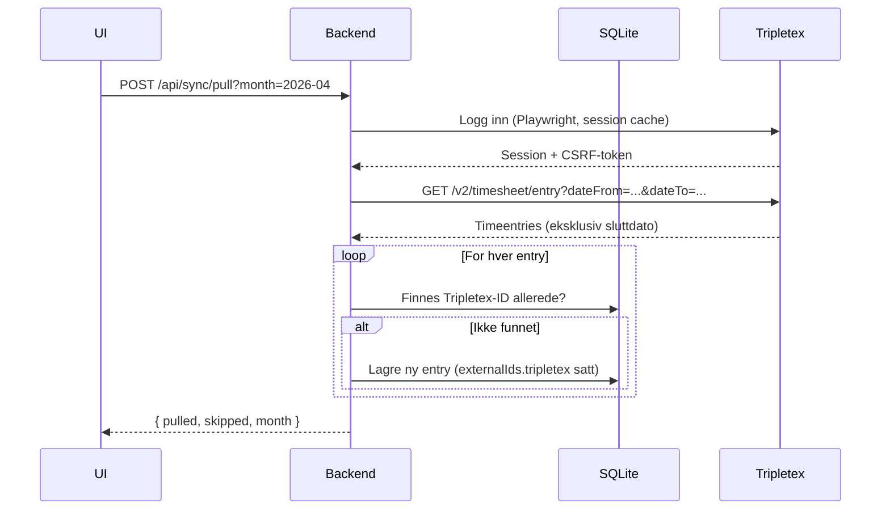
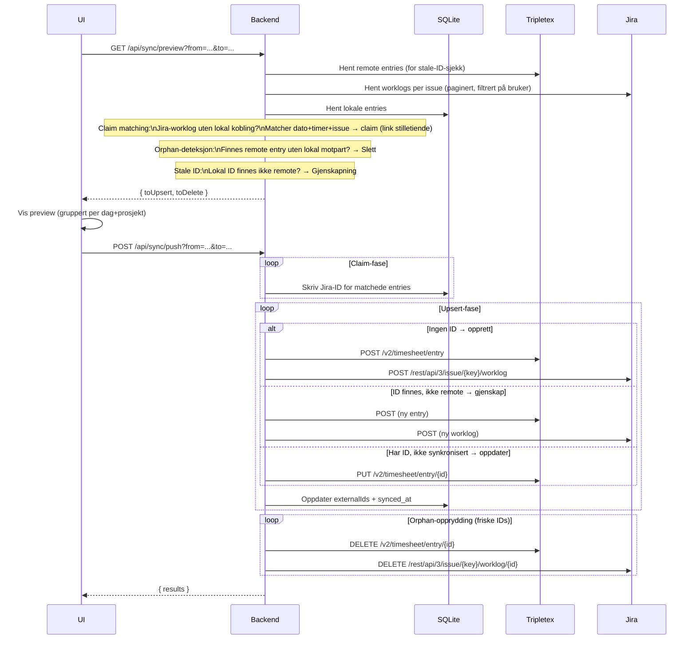

# TimeLog

Et lokalt timeregistreringsverktøy som fungerer som master-kilde og synkroniserer timer mot **Tripletex** og **Jira**.

---

## Arkitektur

```
┌─────────────────────────────────────────┐
│            Browser (React + Vite)       │
│                TimeLog UI               │
└────────────────────┬────────────────────┘
                     │ HTTP (localhost:3001)
┌────────────────────▼────────────────────┐
│         Express backend (Node.js)       │
│              SQLite database            │
└────────┬──────────────────┬─────────────┘
         │                  │
┌────────▼──────┐   ┌───────▼──────────┐
│   Tripletex   │   │      Jira        │
│  (Playwright  │   │  (REST API v3)   │
│   + fetch)    │   │                  │
└───────────────┘   └──────────────────┘
```

---

## Flyt: Pull fra Tripletex



---

## Flyt: Push til Jira + Tripletex



---

## Datamodell

### `time_entries` (SQLite)

| Kolonne | Type | Beskrivelse |
|---|---|---|
| `id` | TEXT (UUID) | Intern ID |
| `date` | TEXT | ISO-dato, f.eks. `2026-05-07` |
| `hours` | REAL | Timer |
| `project_id` | TEXT | Referanse til prosjekt |
| `description` | TEXT | Valgfri kommentar |
| `synced_at` | TEXT | Satt når appen selv pushet; `null` = importert fra Tripletex eller klaimed |
| `external_tripletex_id` | TEXT | Tripletex entry-ID |
| `external_jira_id` | TEXT | Sammensatt: `ISSUE-KEY:worklogId`, f.eks. `TIM-6:48213` |

### `project_mappings`

Kobler interne prosjekter til Tripletex-prosjekt/aktivitet og Jira-prosjekt/issue.

---

## Synkroniseringslogikk

### Master-kilde
Appen (SQLite) er alltid master. Pull importerer fra Tripletex, men overskriver aldri eksisterende entries.

### Claim matching
Entries importert fra Tripletex mangler Jira-ID. Når preview kjøres, sammenlignes Jira-worklogs med lokale entries på `issueKey + dato + timer`. Treff → ID skrives til DB uten å opprette duplikat.

### Stale ID-deteksjon
Dersom en lokal entry har en Tripletex- eller Jira-ID som ikke lenger finnes remote (f.eks. slettet direkte i Tripletex), gjenskapes den automatisk ved neste push.

### `syncedAt`-semantikk
- `null` → entry ble importert via pull eller claim-matching (ikke app-originert push)
- Satt → entry ble vellykket pushet av appen

---

## Datoer og tidssoner

Alle datoberegninger bruker **lokal tid** (ikke UTC) for å unngå off-by-one-feil i UTC+2. Tripletex API bruker **eksklusiv** `dateTo` – backend sender alltid første dag i neste måned som sluttdato.

---

## Teknologier

| Del | Teknologi |
|---|---|
| Frontend | React, Vite, TypeScript, TanStack Query, date-fns |
| Backend | Node.js, Express, TypeScript, better-sqlite3 |
| Tripletex-autentisering | Playwright (headless Chromium, session-cache i SQLite) |
| Jira | REST API v3, Basic Auth |
| Norske helligdager | Meeus/Jones/Butcher-algoritmen (beregnet lokalt, ingen API) |
